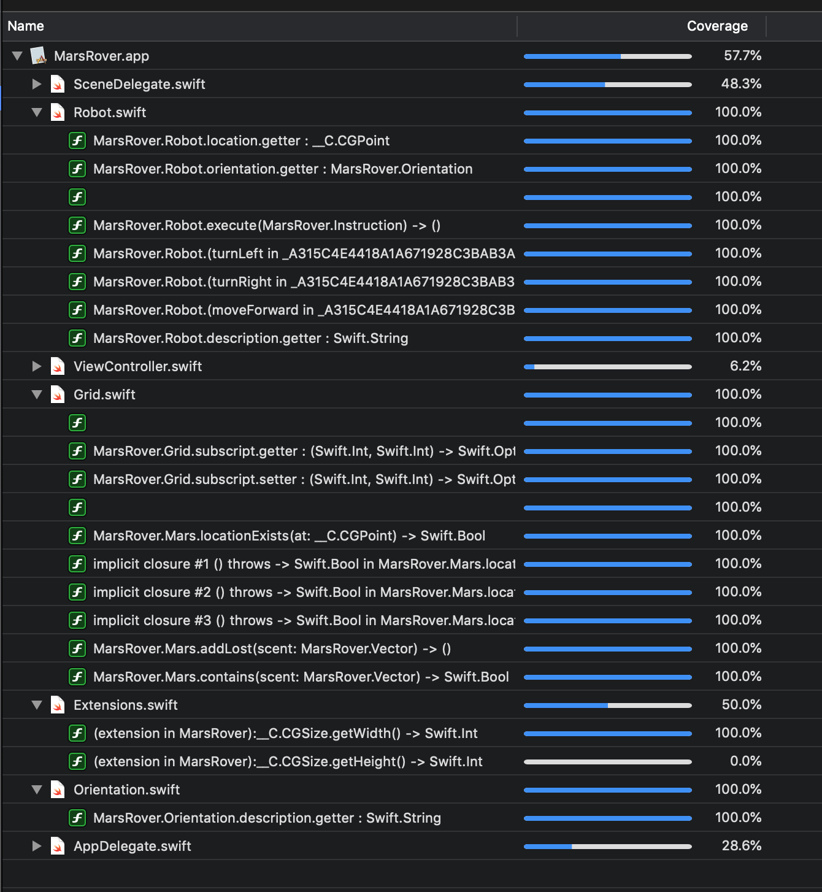

## Mars Rover Challenge

Run the project in xcode or run the unit tests.

The sample data is used in MarsRoverTests.swift under unit tests (MarsRoverTests)

TODO:

- [ ] Document all code
- [ ] Add UI elements for user to interact with the app
- [ ] Add validation rules. Max coordinate = 50, max instructions length = 100

Good test coverage on my code. ViewControllers and Delegates are hard to test and would fare much better with UI tests

